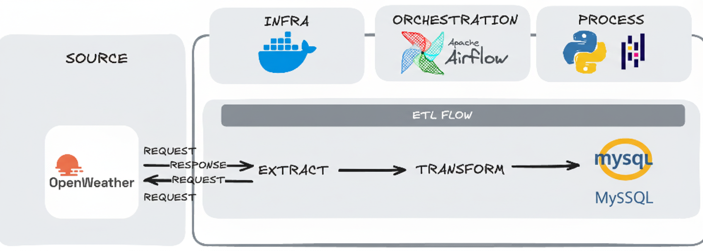

🌤️ Pipeline ETL - Dados Climáticos de São Paulo

> Pipeline ETL automatizado para coleta, transformação e armazenamento de dados meteorológicos em tempo real da cidade de São Paulo.

---

## 📋 Índice

- [Sobre o Projeto](#-sobre-o-projeto)
- [Arquitetura do Pipeline](#-arquitetura-do-pipeline)
- [Stack Tecnológica](#-stack-tecnológica)
- [Estrutura do Projeto](#-estrutura-do-projeto)
- [Pré-requisitos](#-pré-requisitos)
- [Instalação e Configuração](#-instalação-e-configuração)
- [Como Executar](#-como-executar)
- [Detalhamento das Etapas](#-detalhamento-das-etapas)
- [Análise de Dados](#-análise-de-dados)

---

## 🎯 Sobre o Projeto

Este projeto foi desenvolvido com o objetivo de demonstrar a construção de um **pipeline ETL completo** utilizando as melhores práticas de Engenharia de Dados.

O pipeline coleta dados meteorológicos da API OpenWeatherMap a cada hora, transforma os dados para um formato estruturado e os armazena em um banco de dados MySQL para análises futuras.


## 🏗️ Arquitetura do Pipeline



---

## 🛠️ Stack Tecnológica

### Core
- **Python 3.14+** - Linguagem principal
- **Apache Airflow 3.1.7** - Orquestração do pipeline
- **MySQL** - Banco de dados relacional
- **Docker & Docker Compose** - Containerização

### Bibliotecas Python
- **pandas** - Manipulação e transformação de dados
- **requests** - Requisições HTTP para a API
- **SQLAlchemy** - ORM para interação com o banco de dados
- **mysql-connector-python** - Driver MySQL
- **python-dotenv** - Gerenciamento de variáveis de ambiente

### Outras Ferramentas
- **Redis** - Message broker para Celery
- **Jupyter Notebook** - Análise exploratória de dados
- **UV** - Gerenciador de pacotes Python rápido

---

## 🚀 Instalação e Configuração

### 1️⃣ Clone o Repositório

```bash
git clone https://github.com/Enzoonofre/weather_pipeline_ETL.git
cd weather_pipeline_ETL
```

### 2️⃣ Obtenha sua API Key do OpenWeatherMap

1. Acesse [OpenWeatherMap](https://openweathermap.org/api)
2. Crie uma conta gratuita
3. Gere sua API Key no dashboard
4. Guarde sua chave para o próximo passo

### 3️⃣ Configure as Variáveis de Ambiente

Crie um arquivo `.env` dentro da pasta `config/`:

```bash
# config/.env

# OpenWeatherMap API
API_KEY=sua_chave_api_aqui

# MySQL (para testes locais)
user=airflow
password=airflow
database=airflow
```

> ⚠️ **IMPORTANTE**: Nunca commite o arquivo `.env` no Git!

### 4️⃣ Inicialize o Ambiente Airflow

```bash
# Crie a estrutura de pastas necessária
mkdir -p ./dags ./logs ./plugins ./config ./data ./src ./notebooks

# Configure as permissões (Linux/Mac)
echo -e "AIRFLOW_UID=$(id -u)" > .env
```

### 5️⃣ Inicie os Containers Docker

```bash

# Inicie todos os serviços
docker-compose up -d
```

Aguarde alguns minutos para todos os serviços iniciarem.

### 6️⃣ Verifique se tudo está rodando

```bash
docker-compose ps
```

Você deve ver todos os serviços com status **`healthy`** ou **`running`**:
- airflow-apiserver
- airflow-scheduler
- airflow-worker
- airflow-triggerer
- redis

---

## 🎮 Como Executar

### 1️⃣ Acesse a Interface do Airflow

Abra seu navegador em: **http://localhost:8080**

**Credenciais padrão:**
- Username: `airflow`
- Password: `airflow`

### 2️⃣ Ative a DAG

1. Na interface do Airflow, localize a DAG chamada **`youtube_weather_pipeline`**
2. Clique no botão de **Acionar/Trigger** para ativá-la
3. A DAG está configurada para executar **a cada 1 hora**

---

## 🔍 Detalhamento das Etapas

### 📥 **ETAPA 1: EXTRACT**

**Arquivo:** [`src/extract_data.py`](src/extract_data.py)

**O que faz:**
1. Faz uma requisição HTTP GET para a API do OpenWeatherMap
2. Valida o status code da resposta (200 = sucesso)
3. Salva os dados brutos em formato JSON em `data/weather_data.json`

**Dados coletados:**
- Temperatura atual, mínima e máxima
- Sensação térmica
- Umidade e pressão atmosférica
- Velocidade e direção do vento
- Nível de nuvens
- Horários de nascer e pôr do sol
- Coordenadas geográficas

---

### 🔄 **ETAPA 2: TRANSFORM**

**Arquivo:** [`src/transform_data.py`](src/transform_data.py)

**O que faz:**

#### 2.1 **Criação do DataFrame**
- Lê o arquivo JSON
- Converte para DataFrame Pandas
- Normaliza dados aninhados usando `pd.json_normalize()`

#### 2.2 **Normalização da coluna 'weather'**
- A coluna `weather` vem como lista de dicionários
- Extrai: `weather_id`, `weather_main`, `weather_description`, `weather_icon`
- Concatena com o DataFrame principal

#### 2.3 **Remoção de colunas desnecessárias**
```python
columns_to_drop = ['weather', 'weather_icon', 'sys.type']
```

#### 2.4 **Renomeação de colunas**
Padronização para nomes claros em inglês:
- `main.temp` → `temperature`
- `main.humidity` → `humidity`
- `coord.lon` → `longitude`
- `sys.sunrise` → `sunrise`
- E outros...

#### 2.5 **Conversão de timestamps**
Colunas convertidas de Unix timestamp para datetime:
```python
columns_to_normalize = ['datetime', 'sunrise', 'sunset']

# Converte para datetime do fuso horário de São Paulo
df[col] = pd.to_datetime(df[col], unit='s', utc=True)
         .dt.tz_convert('America/Sao_Paulo')
```

**Resultado:** DataFrame limpo, estruturado e pronto para análise

---

### 💾 **ETAPA 3: LOAD**

**Arquivo:** [`src/load_data.py`](src/load_data.py)

**O que faz:**

#### 3.1 **Conexão com o banco de dados**
```python
engine = create_engine(
    f"mysql+mysqlconnector://{user}:{quote_plus(password)}@{host}:3306/{database}"
)
```

#### 3.2 **Inserção dos dados**
```python
df.to_sql(
    name='sp_weather',
    con=engine,
    if_exists='append',  # Adiciona novos registros
    index=False
)
```

#### 3.3 **Validação**
- Faz um `SELECT COUNT(*)` para verificar total de registros
- Loga o resultado para auditoria
---

## 📊 Fluxo da DAG no Airflow

**Arquivo:** [`dags/weather_dag.py`](dags/weather_dag.py)

### Configuração da DAG

```python
@dag(
    dag_id='youtube_weather_pipeline',
    schedule='0 */1 * * *',  # Executa a cada 1 hora
    start_date=datetime(2026, 2, 7),
    catchup=False,  # Não executa datas passadas
    tags=['weather', 'etl']
)
```

### Tasks Definidas

```python
@task
def extract():
    extract_weather_data(url)

@task
def transform():
    df = data_transformations()
    df.to_parquet('/opt/airflow/data/temp_data.parquet')

@task
def load():
    df = pd.read_parquet('/opt/airflow/data/temp_data.parquet')
    load_weather_data('sp_weather', df)

# Dependências
extract() >> transform() >> load()
```

**Por que usar Parquet entre transform e load?**
- Formato binário eficiente
- Preserva tipos de dados (datetime, float, etc.)
- Evita problemas com serialização do Airflow

---

## 🧪 Testes Locais (sem Airflow)

Para testar o pipeline sem Docker:

```bash
# Instale as dependências
uv pip install -e .

# Execute o script de teste
uv run main.py
```

> **Nota:** O arquivo `main.py` está comentado por padrão. Descomente-o para usar.

---

## 🛑 Parar e Limpar

### Parar os containers
```bash
docker-compose down
```

### Parar e remover volumes (ATENÇÃO: apaga os dados!)
```bash
docker-compose down -v
```

### Remover dados do Airflow mas manter o MySQL
```bash
docker-compose down
rm -rf logs/*
```
